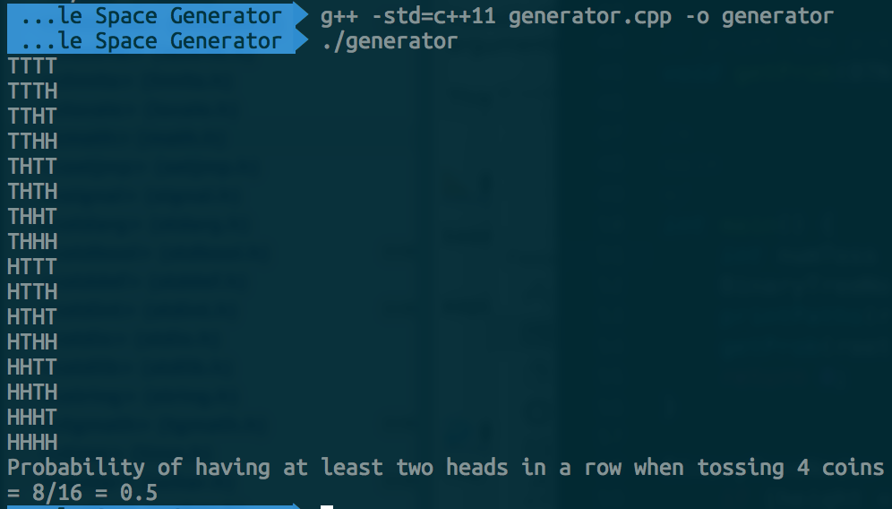
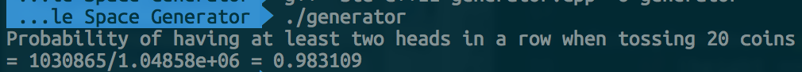

# Coin Toss Sample Space Generator

#### What is it? 
I came across a quite interesting problem: 
> Toss a coin 20 times. 
> Find the probability of having at least 2 heads __in a row__.

I wrote a C++ program to solve the problem. My program generates a balanced binary tree to store all the possible results when tossing a coin X number of times. The task of finding the probability (# of successes / # of all posibilities) is then easy.

 

#### Demo
Sample space of 4 tosses & probability: 

Solution to the problem above!

